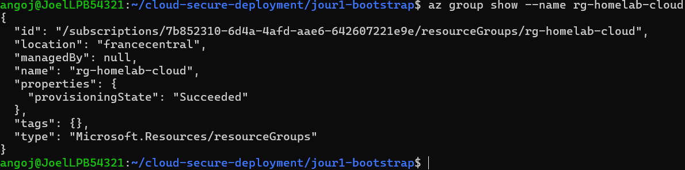
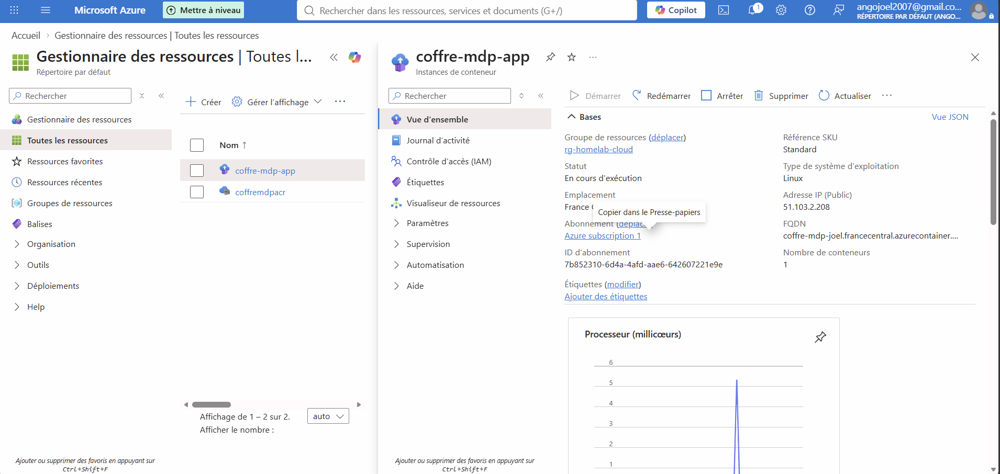

# Cloud Secure Deployment — Azure

Projet de déploiement cloud sécurisé sur Microsoft Azure, avec Infrastructure as Code (Terraform), conteneurisation, gestion des secrets et dossier de gouvernance (EBIOS RM, ISO 27001).

## Objectif

Démontrer une chaîne complète de déploiement cloud sécurisé : de l'infrastructure de base jusqu'à l'analyse de risques et la conformité, en restant dans le free tier Azure.

## Architecture
Compte Azure (Free Tier)
    └── Resource Group : rg-homelab-cloud (France Central)
            ├── Container Registry : coffremdpacr
            ├── Container Instance : coffre-mdp-app (gestionnaire de mots de passe, port 8080)
            └── Key Vault : kv-coffre-mdp-joel (secrets de l'application)

## Avancement
- [x] **Jour 1** — Bootstrap Infrastructure as Code
- [x] **Jour 2** — Déploiement de l'application conteneurisée
- [x] **Jour 3** — IAM least-privilege et chiffrement
- [ ] Jour 4 — Analyse de risques EBIOS RM
- [ ] Jour 5 — Conformité ISO 27001 et destruction des ressources

## Jour 1 — Bootstrap Infrastructure as Code

**Réalisé :**
- Compte Azure gratuit configuré (free tier)
- Azure CLI installé et authentifié
- Terraform (v1.16.0) installé et initialisé
- Premier resource group déployé par code via Terraform : `rg-homelab-cloud` (région France Central)

**Fichiers :**
- `jour1-bootstrap/main.tf` — définition du provider Azure et du resource group

**Preuve de déploiement :**



Vérification indépendante via Azure CLI (`az group show --name rg-homelab-cloud`), confirmant `"provisioningState": "Succeeded"`.

## Jour 2 — Déploiement conteneurisé de l'application

**Réalisé :**
- Application Flask (gestionnaire de mots de passe, chiffrement Fernet) conteneurisée via Docker
- Image poussée vers Azure Container Registry (`coffremdpacr`)
- Déploiement du conteneur via Terraform sur Azure Container Instances
- Application accessible publiquement, uniquement sur le port applicatif (8080), sans accès SSH exposé

**Fichiers :**
- `coffre-mdp-web/Dockerfile` — définition de l'image Docker
- `jour2-deploy/compute.tf` — déploiement du conteneur sur Azure

**URL de l'application déployée :**
`http://coffre-mdp-joel.francecentral.azurecontainer.io:8080`

**Preuve de déploiement :**



Statut confirmé "En cours d'exécution" dans le portail Azure, conteneur unique, adresse IP publique attribuée.

## Jour 3 — IAM least-privilege et chiffrement

**Réalisé :**

* Azure Key Vault `kv-coffre-mdp-joel` créé pour centraliser les secrets
* Secret `fernet-key` stocké dans Key Vault pour le chiffrement des mots de passe
* Secret `flask-secret` stocké dans Key Vault pour la clé de session Flask
* Managed Identity User Assigned `id-coffre-mdp` créée et attachée au conteneur
* Permission `Get` accordée à la Managed Identity pour accéder aux secrets
* Application Flask modifiée pour utiliser `DefaultAzureCredential` et `SecretClient`
* Clé Fernet retirée du conteneur : aucun fichier `key.key` présent dans `/app`
* Image Docker reconstruite et poussée vers Azure Container Registry
* Application redéployée et testée avec succès

**Fichiers :**

* `security/iam-notes.md` — documentation IAM et gestion des secrets
* `coffre-mdp-web/app.py` — récupération des secrets depuis Azure Key Vault
* `coffre-mdp-web/requirements.txt` — dépendances Azure Identity et Key Vault

**Vérifications :**

* Managed Identity présente sur `coffre-mdp-app`
* Application Flask démarrée correctement
* Application accessible sur le port 8080
* Absence de `key.key` dans le conteneur
* Création d'un compte test réussie
* Données enregistrées de manière chiffrée

**Architecture de sécurité :**

`Utilisateur → Container Instance → Flask → Managed Identity → Azure Key Vault → Secrets`

Le principe du moindre privilège est appliqué : l'application peut lire les secrets nécessaires sans disposer de droits d'administration sur le coffre.

## Coût

Projet maintenu dans les limites du free tier Azure (175€ de crédits gratuits disponibles). Aucune ressource facturante déployée à ce stade (un resource group vide n'engendre aucun coût).

## Prérequis pour reproduire ce projet

- Compte Azure (free tier suffisant)
- [Azure CLI](https://learn.microsoft.com/cli/azure/install-azure-cli) installé
- [Terraform](https://developer.hashicorp.com/terraform/install) ≥ 1.7

## Déploiement

```bash
cd jour1-bootstrap
az login
terraform init
terraform plan
terraform apply
```

## Destruction des ressources

*(à documenter au Jour 5, une fois l'ensemble du projet finalisé)*

```bash
terraform destroy
```

---

*Projet réalisé dans le cadre d'une préparation à des candidatures cybersécurité/cloud (Sia, HETIC, iQanto, Equans).*
